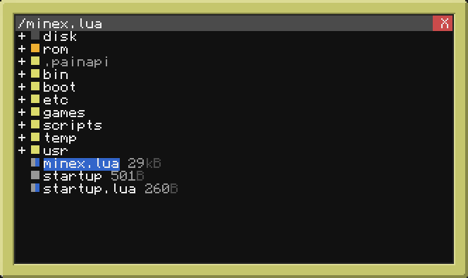

# MineExplorerPlus

A file explorer for ComputerCraft and CC: Tweaked. 

Original program created by ReimarPB, 
with added features by Missooni ♥

## Download
Run `pastebin get Siz3WZMH`.

**Original Features:**
- Tree view display of files and folders
- Navigation with both mouse and keyboard
- Color coded icons depending on type
- Editing and executing files from within the explorer
- Renaming files

**Plus+ features:**
- Program has been condensed into a single file
- Visible file sizes
- More file extension compatibility
- Stores settings api files in 'usr/minexp/' and deleted files in 'temp/minexp' (configurable)
- Colors used in file explorer are now customizable
- New hotkeys have been added, and a mouse-only context menu will appear when right-clicking

**Operations and hotkeys:**\
 Copy file/folder (1 or c)\
 Paste file/folder (2 or v)\
 Rename file/folder (f1 or f2)\
 Delete file/folder (x or Delete)\
 Edit file (leftCtrl)\
 Undo delete (z or Backspace)\
 Run program in shell (Enter)\
 Run program in a new tab (Tab Key)\
 Create new file (Insert)\
 Deselect file or exit context menu (Spacebar)

- Pasting a folder that already exists in a directory will combine the contents of both into a new 'foldername-merged'
- You can duplicate files by copy pasting them into the same directory, this will append a version number to the end

*MineExplorerPlus can delete and remake the directory that stores deleted files, it is off by default.*\
*If you have limited space on your computer, enable this setting or routinely delete your recyling folder.*

_**Do not keep anything important in the recycling folder!**_\
**Use 'Undo' if you accidentally delete an important file.**
